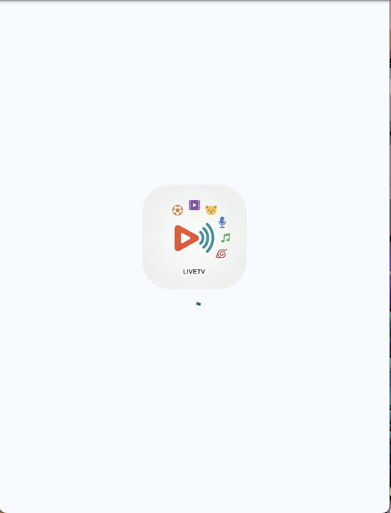
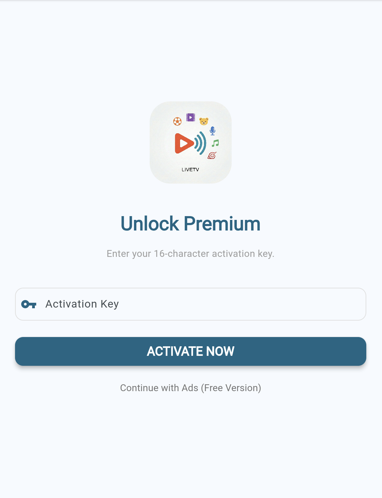
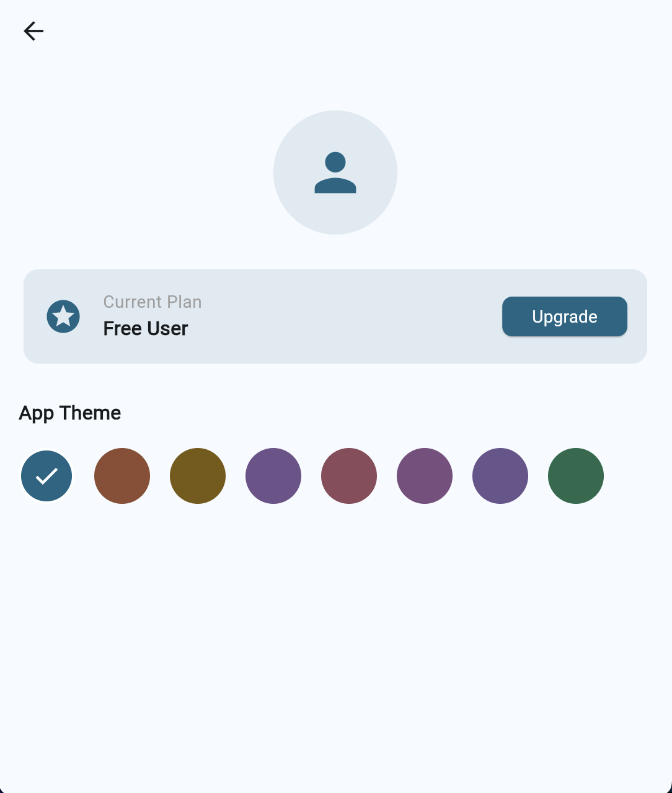
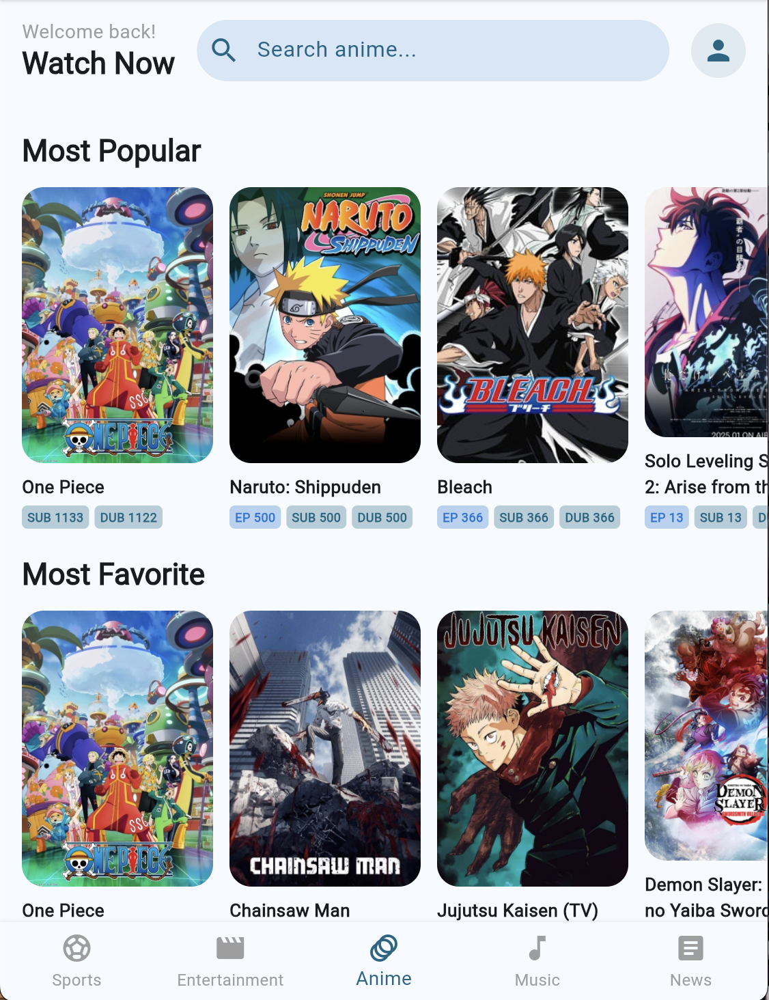
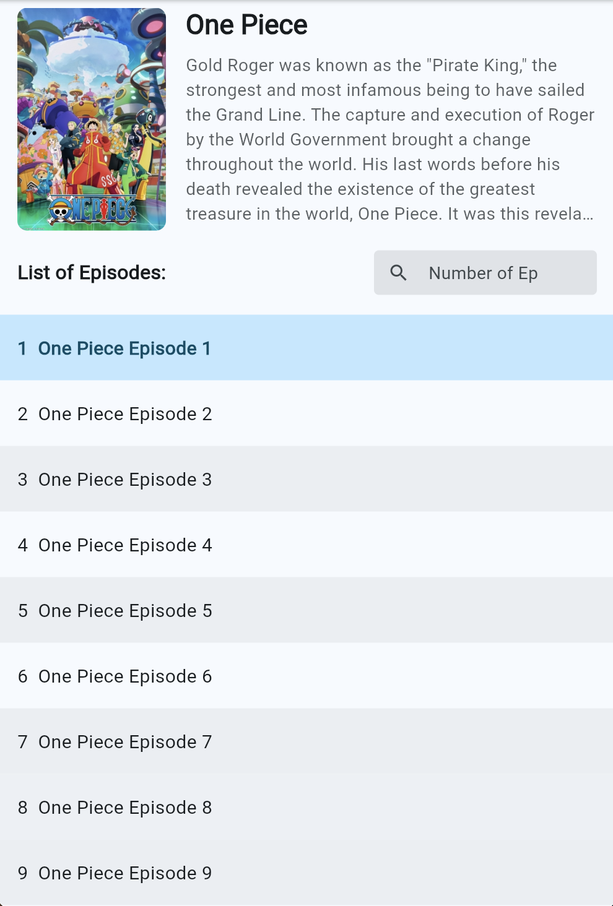
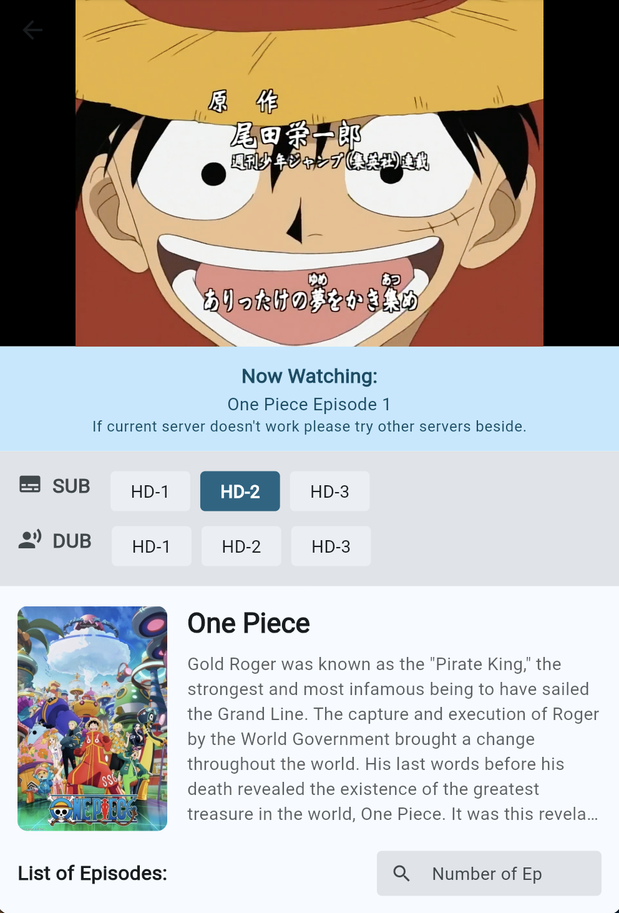
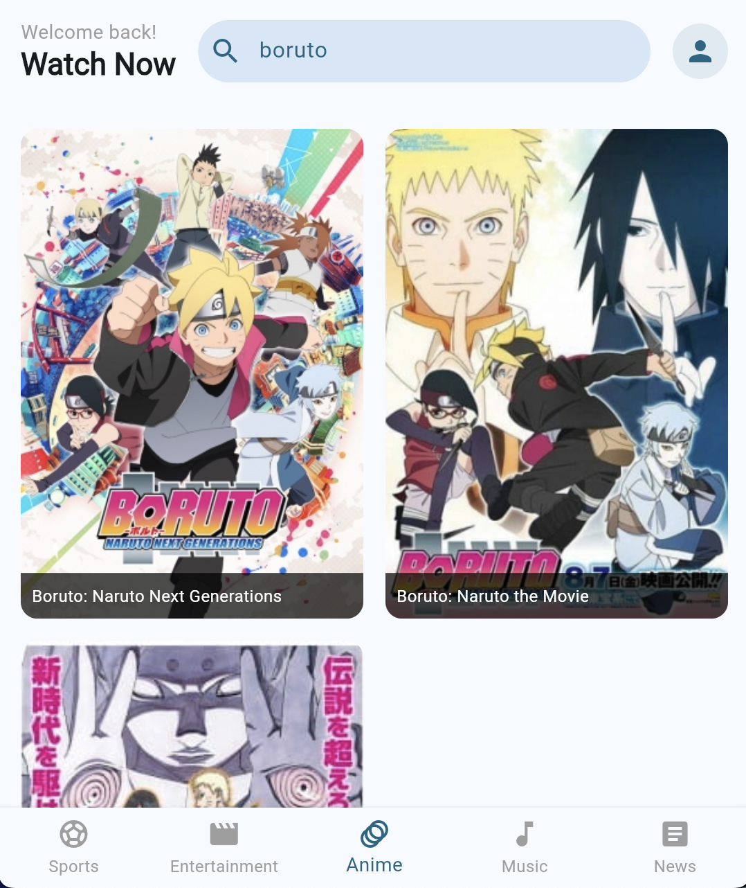
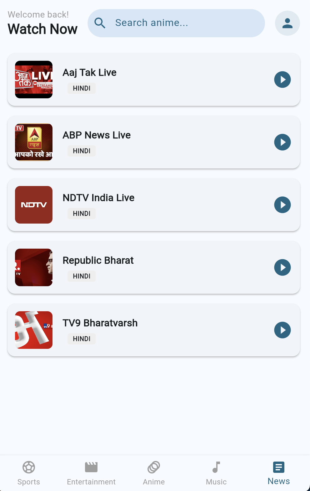
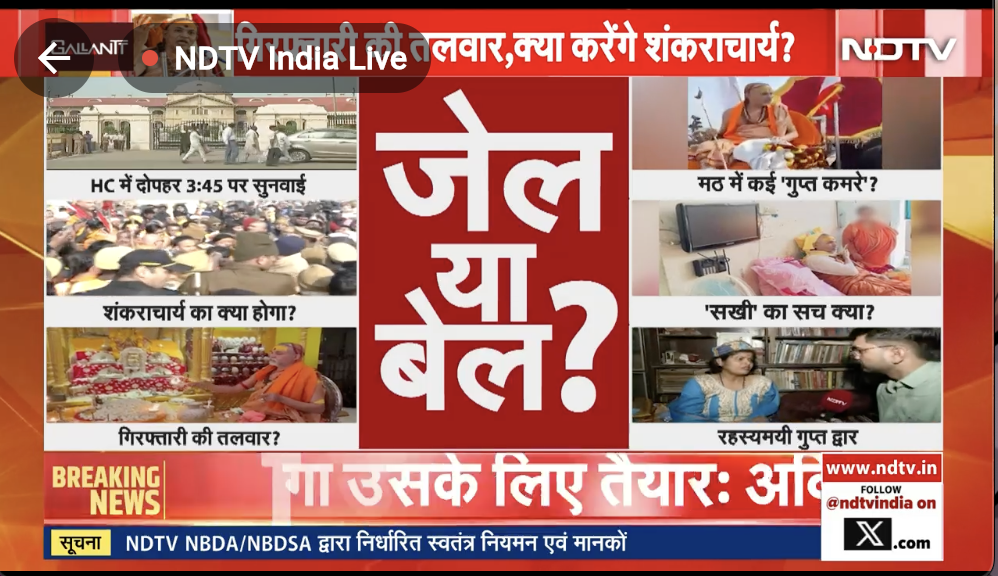

# LiveTVFlutter

A full-scale **cross-platform Live TV / OTT application** built with **Flutter**, supporting **Android, iOS, and Web**.  
The app delivers **HLS (.m3u8) streaming**, subscription-based access (Free & Premium), multi-theme UI, and a **feature-first Clean Architecture**.

This project demonstrates **production-grade Flutter engineering**, not a demo or tutorial app.

---
## 📸 Screenshots

| Splash Screen | Activation Screen | Profile Screen |
|------|------|-----------|
|  |  |  |

| Anime | Anime Detail | Anime Streaming | Anime Search |
|-------------|-------------|-------------|---------|
|  |  |  |  |

| Live Channels | Live channels Streaming |
|-------------|-------------|
|  |  |

## 🚀 Key Features

- 📺 **Live TV & OTT Streaming**
  - HLS (.m3u8) stream support
  - Smooth playback using Flutter video player
  - Handles live and on-demand content

- 💳 **Free & Premium Subscription Model**
  - Feature/content gating based on user plan
  - Centralized access control logic

- 🎨 **Multi-Theme Support**
  - 12+ application themes
  - Dynamic theme switching
  - Consistent theming across platforms

- 💾 **Local Storage & Persistence**
  - Hive used for fast, lightweight local storage
  - Caching of user preferences and app state

- 🌐 **Network Layer**
  - REST API integration using Dio
  - Centralized API client
  - Error and response handling

- 🧩 **Dependency Injection**
  - GetIt for service location
  - Loose coupling between layers
  - Easy scalability and testability

- 🧱 **Feature-First Clean Architecture**
  - Clear separation of concerns
  - Domain-driven feature organization
  - Scalable and maintainable codebase

---

## 🏗 Architecture Overview

The project follows a **Feature-First Clean Architecture**:
```markdown
lib/
├── core/
│ ├── network/
│ ├── di/
│ ├── theme/
│ └── utils/
├── features/
│ ├── auth/
│ ├── home/
│ ├── live_tv/
│ ├── subscription/
│ └── settings/
└── main.dart
```

### Layers
- **Presentation** → UI, widgets, screens
- **Domain** → Business logic, use cases
- **Data** → API, local storage (Hive), repositories

---

## 🛠 Tech Stack

- **Flutter / Dart**
- **Video Streaming**: HLS (.m3u8), Flutter Video Player
- **State & DI**: GetIt
- **Networking**: Dio
- **Local Storage**: Hive
- **Architecture**: Feature-First Clean Architecture
- **Theming**: Multi-theme dynamic UI

---

## 📦 Supported Platforms

- ✅ Android
- ✅ iOS
- ✅ Web

---

## ▶️ Getting Started

```bash
flutter pub get
flutter run
```
